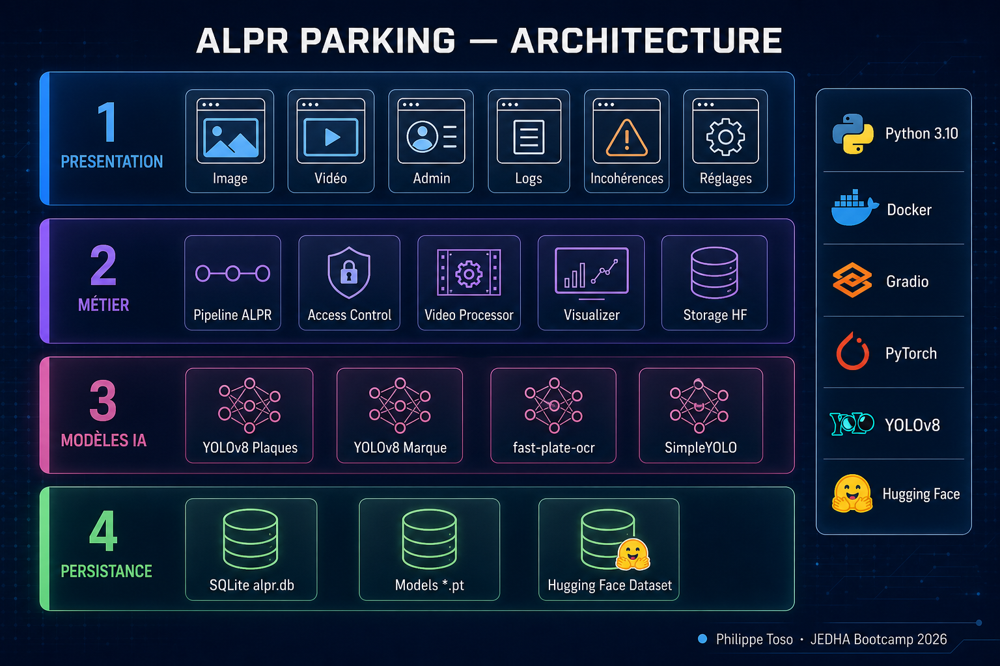
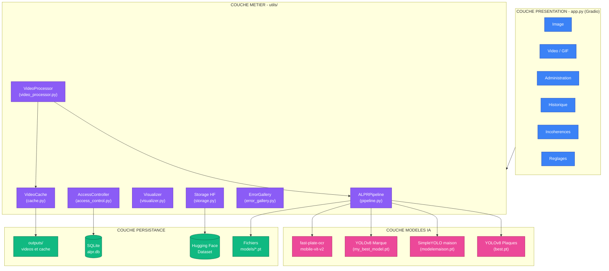
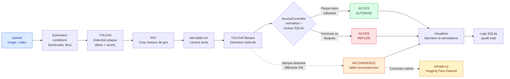
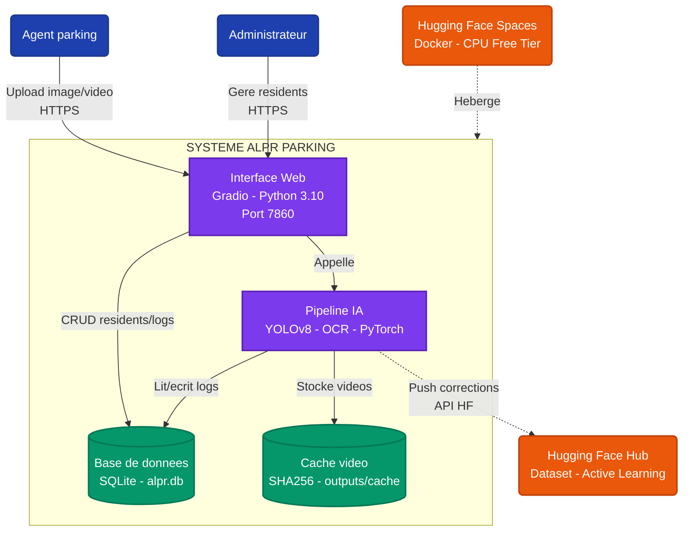
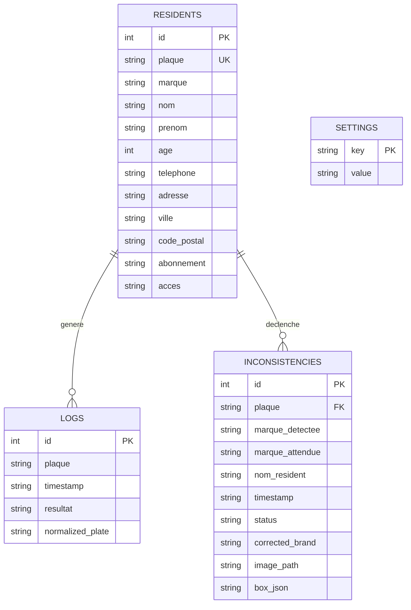
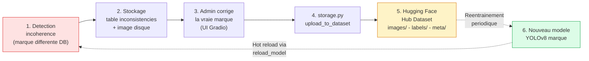

# Architecture du système ALPR Parking

> Document de référence pour la soutenance — Certification Data Fullstack JEDHA Bootcamp
> Auteur : Philippe Toso

**Liens** : [Démo Hugging Face](https://huggingface.co/spaces/philippetos/projetplaques) · [Code GitHub](https://github.com/philippetoso-commits/jedha_portfolio/tree/main/projet%20plaque)

---

## Table des matières

1. [Pitch en 30 secondes](#pitch-en-30-secondes)
2. [Vue d'ensemble — Architecture en 4 couches](#vue-densemble--architecture-en-4-couches)
3. [Flux de données runtime](#flux-de-données-runtime)
4. [Modèle C4 — niveau Container](#modèle-c4--niveau-container)
5. [Modèle de données — Base SQLite](#modèle-de-données--base-sqlite)
6. [Stack technique et arbitrages](#stack-technique-et-arbitrages)
7. [Boucle d'apprentissage actif (Active Learning)](#boucle-dapprentissage-actif-active-learning)
8. [Décisions d'architecture (ADR light)](#décisions-darchitecture-adr-light)
9. [Points forts à mettre en avant](#points-forts-à-mettre-en-avant)

---

## Pitch en 30 secondes

**ALPR Parking** est une application web complète de **reconnaissance automatique de plaques d'immatriculation** pour le contrôle d'accès d'un parking résidentiel.

Le système combine :

- **Deux modèles de Computer Vision** (détection plaque + détection marque) en *transfer learning* sur YOLOv8
- **Un modèle d'OCR** spécialisé (`fast-plate-ocr`, 220 000 plaques d'entraînement)
- **Une base de données** des résidents autorisés (SQLite)
- **Une interface web** complète (Gradio) avec administration en temps réel
- **Une boucle d'apprentissage actif** branchée sur Hugging Face Hub

> Déployé en conteneur Docker sur Hugging Face Spaces.

---

## Vue d'ensemble — Architecture en 4 couches

L'application suit une architecture en couches strictes, où chaque module a une responsabilité unique.

**Lecture du schéma** : la couche présentation ne connaît que la couche métier. La couche métier orchestre les modèles IA et la persistance. Aucun couplage transverse, ce qui rend l'application maintenable et testable.

---

## Flux de données runtime

Trace exacte d'une requête utilisateur, de l'upload à la décision d'ouverture de barrière.

**Particularité** : le système ne se contente pas d'autoriser ou de refuser. Il vérifie aussi la **cohérence carte grise** (la marque détectée correspond-elle à celle déclarée pour cette plaque ?). Toute anomalie alimente la boucle d'apprentissage actif.

---

## Modèle C4 — niveau Container

Vision « architecte logiciel » : qui parle à qui, à travers quels protocoles.

---

## Modèle de données — Base SQLite

Quatre tables couvrent la totalité du domaine métier.

**Index de performance** :

- `idx_logs_plaque` sur `logs(plaque)` permet la recherche rapide d'historique
- `idx_logs_timestamp` sur `logs(timestamp DESC)` permet le tri des logs récents

---

## Stack technique et arbitrages

| Couche | Technologie retenue | Justification |
|---|---|---|
| **Détection plaques** | Ultralytics YOLOv8n + Transfer Learning | Léger (~6 Mo), CPU-compatible, état de l'art, fine-tuning rapide (100 époques) |
| **Détection plaques (alt.)** | SimpleYOLO maison (PyTorch) | Démonstration de maîtrise : architecture grid 13x13 implémentée *from scratch* |
| **OCR** | fast-plate-ocr (`global-plates-mobile-vit-v2`) | Pré-entraîné sur 220 k plaques, 40+ pays, faible latence |
| **Détection marque** | YOLOv8 fine-tuné (`my_best_model.pt`) | Cohérence avec la stack de détection principale |
| **Backend BDD** | SQLite | Zero-config, fichier unique, suffisant pour la volumétrie cible (< 10 k résidents) |
| **Interface** | Gradio 4 | Démo IA native, itération rapide, support Spaces officiel |
| **Traitement vidéo** | OpenCV + ffmpeg | Codec adaptatif (vp80/avc1/mp4v) + ré-encodage H.264 pour compatibilité navigateur |
| **Active Learning** | huggingface_hub API | Standard de fait pour partage de datasets ML |
| **Conteneurisation** | Docker (`python:3.10-slim`, user 1000) | Sécurité (non-root) + reproductibilité bit-à-bit |
| **Hébergement** | Hugging Face Spaces (Docker SDK) | Gratuit, intégré à l'écosystème ML, déploiement Git push |

### Pourquoi *ne pas* avoir choisi…

- **PostgreSQL** : surdimensionné pour un parking résidentiel ; SQLite suffit largement
- **Streamlit** : moins adapté aux applis IA *interactives* avec uploads multiples (Gradio est natif)
- **EasyOCR / Tesseract** : moins précis sur plaques que `fast-plate-ocr` qui est *spécialisé*
- **Docker Compose / Kubernetes** : un seul container, l'orchestration apporterait de la complexité sans bénéfice

---

## Boucle d'apprentissage actif (Active Learning)

C'est l'élément architectural différenciant du projet : le système **apprend de ses erreurs** sans intervention humaine du data scientist.

**Bénéfices** :

- Le dataset s'enrichit automatiquement de cas réels challengeants
- Pas de fuite de données : seules les incohérences sont remontées (RGPD-friendly)
- Découplage temporel : entraînement asynchrone sans bloquer la production

---

## Décisions d'architecture (ADR light)

### ADR-001 : Pourquoi un dossier `utils/` plutôt qu'un package installable ?

**Contexte** : déploiement sur Hugging Face Spaces avec `app.py` à la racine.
**Décision** : code métier dans `utils/` importé en chemins relatifs.
**Conséquence** : déploiement simplifié (un seul `Dockerfile`), au prix d'une réutilisation cross-projet limitée.

### ADR-002 : Hot-reload des modèles plutôt que redémarrage

**Contexte** : Spaces gratuit limité en RAM (16 Go) ; redémarrer = ~30 s d'indisponibilité.
**Décision** : méthode `reload_model()` qui charge le nouveau modèle **avant** de libérer l'ancien (`gc.collect()`).
**Conséquence** : pic transitoire de RAM mais zéro downtime utilisateur.

### ADR-003 : Cache vidéo basé sur SHA256

**Contexte** : retraiter une vidéo de 30 s prend 60 à 120 s sur CPU.
**Décision** : cache `outputs/cache/` indexé par hash (10 premiers Mo) + paramètres de traitement.
**Conséquence** : démos répétées instantanées, économie CPU significative.

### ADR-004 : Normalisation des plaques avant comparaison

**Contexte** : OCR retourne `AB-123-CD` ou `AB 123 CD` selon la qualité.
**Décision** : `re.sub(r'[^A-Z0-9]', '', text.upper())` avant lookup allowlist.
**Conséquence** : tolérance native aux variations de format ; pas de faux refus pour cause de séparateur.

---

## Points forts à mettre en avant

Pour la soutenance, voici les arguments architecturaux à dérouler dans cet ordre :

1. **Application web complète, pas un notebook** : preuve de bout en bout
2. **Deux modèles YOLO + un OCR orchestrés** : maîtrise multi-modèles
3. **Modèle from-scratch** (SimpleYOLO) : compréhension de ce qui se passe sous le capot
4. **Architecture 4 couches respectée** : code maintenable et testable
5. **Boucle d'Active Learning** : le système s'améliore tout seul
6. **Déploiement reproductible** (Docker + HF Spaces) : pas un POC bricolé
7. **Conformité RGPD** : minimisation des données, pas d'identification de personnes
8. **Optimisations production** : hot-reload, cache, codec adaptatif, index SQL

---

## Annexes

- Documentation fonctionnelle complète : [`projetplaquetransfert/docs/DOCUMENTATION_COMPLETE.md`](./projetplaquetransfert/docs/DOCUMENTATION_COMPLETE.md)
- Détail du modèle from-scratch : [`projetplaquetransfert/docs/ARCHITECTURE_MODELE_MAISON.md`](./projetplaquetransfert/docs/ARCHITECTURE_MODELE_MAISON.md)
- Nouvelles fonctionnalités v2 : [`projetplaquetransfert/docs/NOUVELLES_FONCTIONNALITES.md`](./projetplaquetransfert/docs/NOUVELLES_FONCTIONNALITES.md)
- Administration SQL : [`projetplaquetransfert/docs/SQL_ADMINISTRATION.md`](./projetplaquetransfert/docs/SQL_ADMINISTRATION.md)
- Visuel de présentation (slide d'ouverture) : [`architecture_hero.png`](./architecture_hero.png)
- Schéma technique des 4 couches (HD 2400 px) : [`architecture_technique.png`](./architecture_technique.png)
- Schéma du flux runtime (HD 2400 px) : [`architecture_flux.png`](./architecture_flux.png)
- Code source de l'application : [`projetplaquetransfert/`](./projetplaquetransfert/)

---

*Document généré pour la soutenance de certification — Data Fullstack JEDHA Bootcamp*
