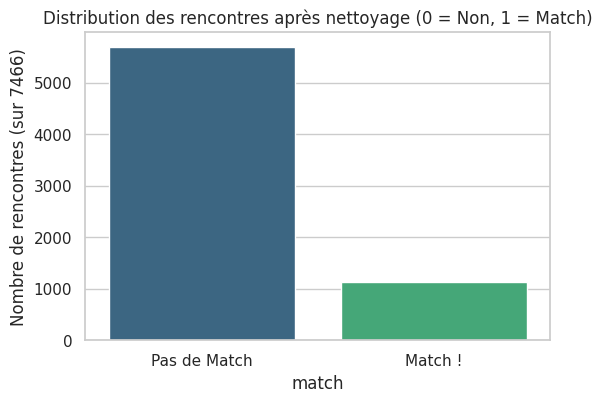
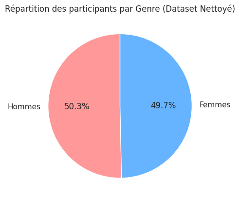
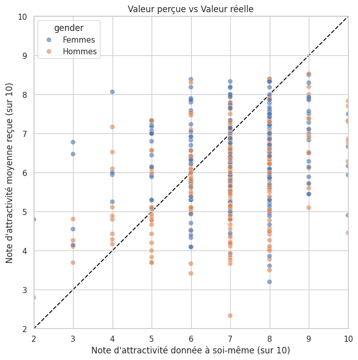
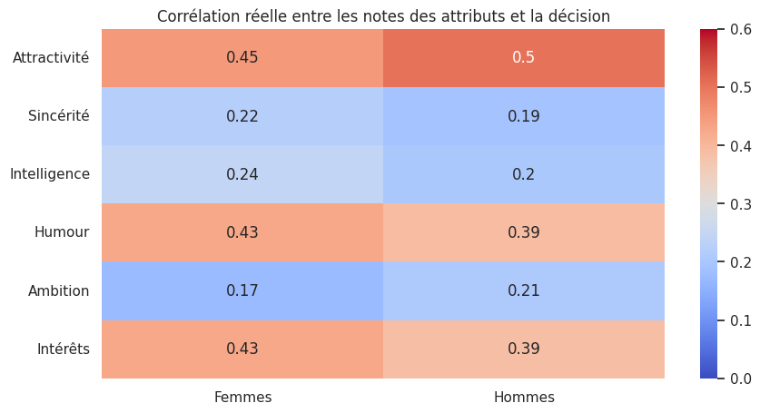
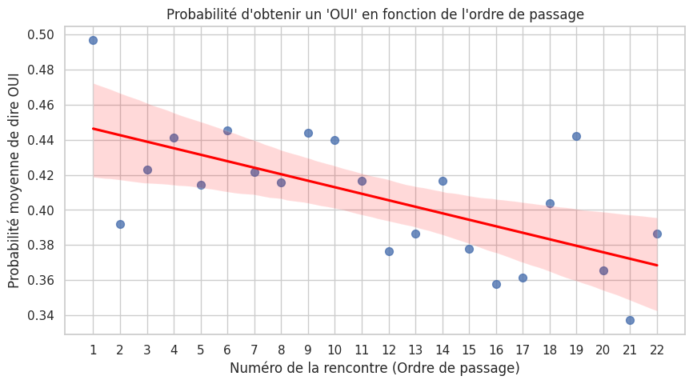
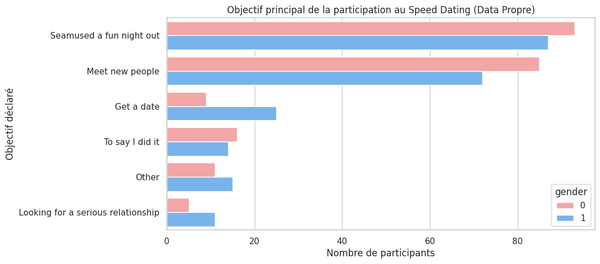

# Projet Speed Dating 💘 (Tinder)

Quelles sont les motivations qui incitent les individus à envisager un second rendez-vous ensemble ?  
Ce projet explore un jeu de données rassemblant des informations sur 7466 rencontres (speed datings) organisées auprès d'étudiants, pour comprendre ce qui déclenche l'envie de se revoir.



## 1. Statistiques de départ et Qualité des données

Sur l'ensemble du jeu de données, l'identifiant maximum (`iid`) va jusqu'à 552, mais l'individu ID=118 est manquant dans la base. Nous avons donc exactement **551 participants uniques**.

L'échantillon est parfaitement paritaire en termes de genre (274 femmes environ, et l'équivalent en hommes). 
Les participants sont majoritairement très jeunes, avec un âge compris entre 22 et 30 ans.

```python
# Exploration de la répartition par genre
# 0 = Femme, 1 = Homme
gender_counts = df['gender'].value_counts()
print(gender_counts)

plt.figure(figsize=(6, 4))
sns.countplot(data=df, x='gender', palette='Set2')
plt.title("Répartition des genres")
plt.xticks([0, 1], ['Femmes', 'Hommes'])
plt.show()
```



En nettoyant les données en amont (grâce au script `cleaning.py`), nous avons supprimé près de 10% des données (vagues avec un système de notation différent sur 100 et rencontres sans décision finale). L'analyse repose désormais sur un panel robuste de **7466 rencontres**.

## 2. Estimations vs Réalité

Les participants semblent avoir tendance à surestimer leur propre valeur perçue par rapport à la valeur qui leur est assignée par les autres. Cela peut refléter un biais de surconfiance.

```python
# Différence entre évaluation propre (attr3_1) et l'évaluation reçue des autres (attr_o)
df['self_eval_diff'] = df['attr3_1'] - df['attr_o']

plt.figure(figsize=(8, 5))
sns.histplot(df['self_eval_diff'].dropna(), bins=30, kde=True, color='purple')
plt.title("Différence entre l'auto-évaluation et l'évaluation reçue par les autres (Attractivité)")
plt.xlabel("Différence")
plt.axvline(x=0, color='red', linestyle='--')
plt.show()
```



La corrélation (très faible, autour de 0.2) montre qu'il y a un fort décalage : les individus sont globalement incapables de prédire avec exactitude comment ils seront évalués par leurs partenaires. Les notes reçues sont plus dures (moyennes plus basses) que les notes que les candidats s'attribuent à eux-mêmes.

**Quelle est l'importance de l'attractivité ?**
Les participantes féminines déclarent au départ privilégier l'intelligence et la sincérité, et accordent (selon leurs mots) moins d'importance à l'attrait physique. Cependant, l'analyse des "matches" réels raconte une autre histoire.

```python
# Impact réel : Corrélation note donnée sur un attribut et la décision (dec) de revoir
attributes_ratings = ['attr', 'sinc', 'intel', 'fun', 'amb', 'shar']

correlations = pd.DataFrame()
for gender, g_name in zip([0, 1], ['Femmes', 'Hommes']):
    # Sous-ensemble par genre
    df_g = df[df['gender'] == gender].dropna(subset=attributes_ratings + ['dec'])
    # Calcul des corrélations de Pearson
    corr = df_g[attributes_ratings].corrwith(df_g['dec'])
    correlations[g_name] = corr

correlations.index = ['Attractivité', 'Sincérité', 'Intelligence', 'Humour', 'Ambition', 'Intérêts']

plt.figure(figsize=(10, 5))
sns.heatmap(correlations, annot=True, cmap='coolwarm', vmin=0, vmax=0.6)
plt.title("Corrélation puissante de l'attractivité")
plt.show()
```



**L'attractivité physique (`attr`)** est le critère qui est le plus fortement corrélé avec la décision finale (dire "Oui" au partenaire), chez les hommes comme chez les femmes. Les participants, en particulier les femmes, sous-estiment ou minorent l'importance de l'attirance physique dans leur décision déclarée, alors qu'en réalité, l'attirance contribue massivement à leur choix final.

## 3. Un second rendez-vous ?

Au fil de chaque série de rencontres, les participants semblent de moins en moins enclins à accepter un second rendez-vous à mesure que la soirée progresse. L'attention portée par les candidats et leur indulgence baissent radicalement passé le 10ème ou 15ème rendez-vous.

```python
plt.figure(figsize=(10, 5))
# Taux d'acceptation selon le numéro du rendez-vous
sns.lineplot(data=df.dropna(subset=['order', 'dec']), x='order', y='dec', marker='o')
plt.title("Probabilité de dire OUI en fonction de l'ordre d'apparition du partenaire")
plt.ylabel("Probabilité de décision positive (Oui)")
plt.grid(True)
plt.show()
```



Donc, si une personne souhaite maximiser ses chances d'obtenir un "oui", il pourrait être stratégique pour elle de passer parmi les premiers rounds, lorsque les participants sont encore frais et moins sélectifs.

Enfin, nous avons regardé l'objectif de chaque participant :

```python
# Nettoyage des labels pour 'goal'
goals_mapping = {
    1: 'Seamused a fun night out', 2: 'Meet new people', 3: 'Get a date',
    4: 'Looking for a serious relationship', 5: 'To say I did it', 6: 'Other'
}
df_goals = df.dropna(subset=['goal']).copy()
df_goals['goal_desc'] = df_goals['goal'].map(goals_mapping)

plt.figure(figsize=(10, 5))
sns.countplot(data=df_goals, y='goal_desc', order=df_goals['goal_desc'].value_counts().index, palette='viridis')
plt.title("Objectif principal des participants à la soirée", fontsize=14)
plt.show()
```



La plupart des participants étaient là pour le loisir ou pour le plaisir de rencontrer de nouvelles personnes. Moins de 5% de la population cherchait activement une relation sérieuse. Pourtant, les participants déclarant chercher une vraie relation arrivaient quand même à obtenir une proportion intéressante de réponses favorables.

## 4. Solutions proposées

Pour conclure et répondre aux problématiques de baisse d'interaction de l'équipe marketing Tinder, nous pouvons proposer quelques solutions :

- **Trouver des moyens de communication permettant de réduire l'écart entre perception individuelle et perception des autres.** (Suggestion de photos, mise en avant du profil, conseils de conversation).
- **Diminuer le nombre de partenaires possibles.** Plus il y a de partenaires à rencontrer par session (le "swiping" infini), plus l'intérêt ou l'attention diminue fortement en raison de la fatigue décisionnelle. Mettre un plafond de rencontres / likes par bloc temporel pourrait accroître la qualité de l'attention accordée à chaque profil. 
- Ne pas s'enfermer sur des algorithmes "d'intérêts parfaitement communs". Les centres d'intérêts trop communs ne se traduisent pas forcément par un coup de foudre, et l'utilisateur désire aussi le plaisir de la découverte.
- Garder en tête que les participants ne sont pas pleinement conscients de l'influence de l'apparence physique sur leurs choix. L'interface d'une application de rencontre gagnera toujours à **proposer des profils prioritairement basés sur l'attractivité visuelle** et la qualité des photos, car c'est le facteur décisionnel n°1 prouvé dans les faits.
